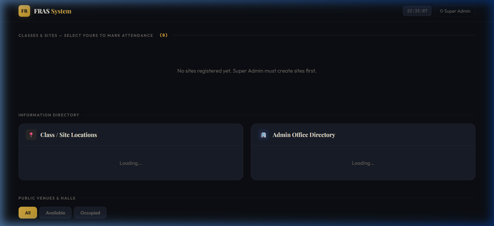
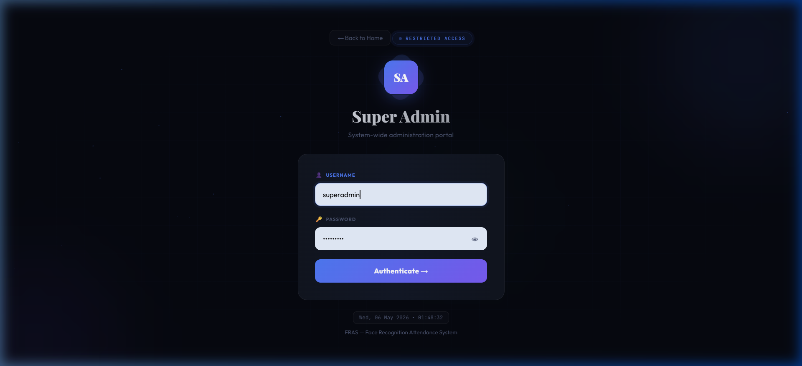
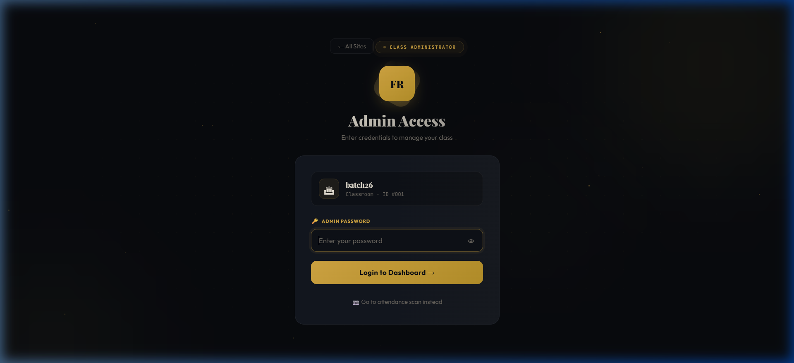
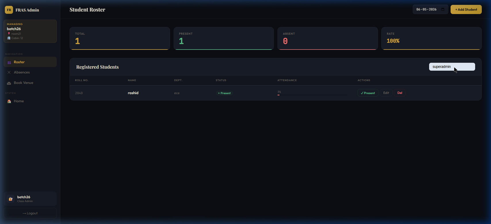

<div align="center">

# 🎯 FRAS — Face Recognition Attendance System

### Intelligent, Real-Time Attendance Management with Face Recognition

[](https://python.org)
[](https://flask.palletsprojects.com)
[](https://opencv.org)
[](https://postgresql.org)
[](https://docker.com)
[](LICENSE)

<br>

**FRAS** is a production-ready, full-stack attendance management system that uses **real-time face recognition** to automate student attendance tracking. Built with Flask, face_recognition (dlib), and a modern dark-themed UI.

<br>

[🚀 Live Demo](#deployment) · [📸 Screenshots](#-screenshots) · [⚙️ Installation](#-quick-start) · [🏗 Architecture](#-architecture)

</div>

---

## ✨ Key Features

| Feature | Description |
|---------|-------------|
| 📷 **Real-Time Face Recognition** | Students scan their face via webcam — attendance is marked instantly |
| 👨‍💼 **Multi-Role Access** | Super Admin → Admin → Student hierarchy with secure authentication |
| 🏫 **Multi-Class Management** | Create unlimited classes/sites with individual admin credentials |
| 📊 **Live Dashboard** | Real-time attendance stats, student roster, and percentage tracking |
| ⏰ **Operating Hours** | Set open/close times per class — blocks scans outside hours |
| 📅 **Date-wise History** | Browse attendance records for any past date |
| 🏛 **Venue Booking** | Public venues with request/approval workflow |
| 🌙 **Premium Dark UI** | Stunning glassmorphism design with micro-animations |
| 🐳 **Docker + PostgreSQL** | Production-ready with persistent data storage |

---

## 📸 Screenshots

<div align="center">

### 🏠 Home Page


<br><br>

### 🔐 Super Admin Login


<br><br>

### 🔑 Admin Login  


<br><br>

### 📊 Admin Dashboard


</div>

---

## 🏗 Architecture

```
┌─────────────────────────────────────────────────────────────┐
│                    FRAS Architecture                         │
├─────────────────────────────────────────────────────────────┤
│                                                             │
│   ┌──────────┐    ┌──────────┐    ┌───────────────────┐    │
│   │  Browser  │───▶│  Flask   │───▶│  PostgreSQL/SQLite│    │
│   │  (Webcam) │    │  Server  │    │    Database       │    │
│   └──────────┘    └────┬─────┘    └───────────────────┘    │
│                        │                                    │
│                   ┌────┴─────┐                              │
│                   │  dlib +  │                              │
│                   │  face_   │                              │
│                   │  recog.  │                              │
│                   └──────────┘                              │
│                                                             │
│   Roles: Super Admin → Admin → Student (Face Scan)         │
└─────────────────────────────────────────────────────────────┘
```

### Tech Stack

| Layer | Technology |
|-------|-----------|
| **Frontend** | HTML5, CSS3 (Glassmorphism), Vanilla JS |
| **Backend** | Python 3.11, Flask 3.0 |
| **Face Recognition** | dlib, face_recognition, OpenCV |
| **Database** | SQLite (dev) / PostgreSQL (prod) |
| **Deployment** | Docker, Gunicorn, Render |

---

## 🚀 Quick Start

### Prerequisites
- Python 3.9+
- CMake (for dlib)
- Webcam (for face recognition)

### Local Development

```bash
# 1. Clone the repository
git clone https://github.com/rashkhan94/face_recognization_attendance_system.git
cd face_recognization_attendance_system

# 2. Create virtual environment
python -m venv venv
source venv/bin/activate  # Linux/Mac
venv\Scripts\activate     # Windows

# 3. Install dependencies
pip install flask face_recognition opencv-python numpy

# 4. Run the application
python app.py
```

Open **http://localhost:5000** in your browser.

### Docker Deployment

```bash
# Build and run
docker build -t fras .
docker run -p 5000:5000 fras
```

---

## 👥 User Roles & Flow

### 🔴 Super Admin
- Create/manage classes (sites)
- Set admin credentials per class
- Configure total classes, operating hours, capacity
- Monitor all attendance across classes
- Manage public venues and booking requests

**Default Login:** `superadmin` / `admin123`

### 🟡 Admin (Class Teacher)
- View student roster with real-time attendance
- Add students with face registration (webcam capture)
- Manually mark attendance
- Edit/delete student records
- View attendance by date
- Request venue bookings

### 🟢 Student
- Scan face at the portal webcam
- Attendance marked automatically with timestamp
- Duplicate scans prevented (one per day)

---

## 📁 Project Structure

```
fras-attendance/
├── app.py                  # Main Flask application (all routes & APIs)
├── init_db.py              # PostgreSQL table initialization
├── schema.sql              # SQLite schema definition
├── requirements.txt        # Python dependencies
├── Dockerfile              # Docker configuration for dlib
├── render.yaml             # Render deployment blueprint
├── templates/
│   ├── index.html          # Landing page with site listing
│   ├── super_admin.html    # Super Admin login (animated)
│   ├── super_admin_dashboard.html  # SA management dashboard
│   ├── admin_login.html    # Admin login (gold theme)
│   ├── admin_dashboard.html # Admin roster & attendance
│   └── user_scanner.html   # Student face scanning portal
├── screenshots/            # App screenshots for README
└── .gitignore
```

---

## 🗄 Database Schema

```sql
organizations    -- Classes/Sites with admin credentials
├── students     -- Registered students with face encodings
│   └── attendance  -- Daily attendance records (student_id + date)
├── public_venues   -- Bookable venues/halls
│   └── venue_requests  -- Booking request workflow
└── super_admin  -- Super admin credentials
```

### Key Tables

| Table | Purpose |
|-------|---------|
| `organizations` | Classes with name, type, admin password, operating hours, total_classes |
| `students` | Name, roll number, age, class, face_encoding (128-d vector as JSON) |
| `attendance` | student_id + date + time (unique per student per day) |
| `public_venues` | Bookable venues with status tracking |
| `venue_requests` | Request/approve/deny workflow |

---

## 🔧 API Reference

### Authentication
| Method | Endpoint | Description |
|--------|----------|-------------|
| POST | `/api/superadmin/login` | Super Admin login |
| POST | `/api/admin/login` | Admin login (per site) |

### Student Management  
| Method | Endpoint | Description |
|--------|----------|-------------|
| GET | `/api/admin/students?date=YYYY-MM-DD` | Get students with attendance status |
| POST | `/api/admin/add_student` | Register student with face |
| POST | `/api/admin/edit_student` | Update student details |
| POST | `/api/admin/delete_student` | Remove student |
| POST | `/api/admin/mark_present` | Manual attendance marking |
| GET | `/api/admin/absents?date=YYYY-MM-DD` | Get absent students |

### Face Recognition
| Method | Endpoint | Description |
|--------|----------|-------------|
| POST | `/api/mark_attendance` | Scan face → auto-mark attendance |

### Super Admin
| Method | Endpoint | Description |
|--------|----------|-------------|
| GET | `/api/superadmin/stats` | Dashboard statistics |
| GET | `/api/superadmin/sites` | List all classes |
| POST | `/api/superadmin/add_site` | Create new class |
| POST | `/api/superadmin/edit_site` | Update class settings |
| DELETE | `/api/superadmin/delete_site/:id` | Delete class |

---

## ⚡ How Face Recognition Works

```
1. REGISTRATION (Admin Panel)
   Student face → Webcam capture → face_recognition library
   → 128-dimensional face encoding → Stored as JSON in DB

2. ATTENDANCE (Student Portal)  
   Live webcam feed → Capture frame → Extract face encoding
   → Compare with stored encodings (tolerance: 0.50)
   → Match found → Insert attendance record (student_id + date + time)
   → Duplicate check prevents re-marking same day
```

---

## 🛡 Security Features

- ✅ Per-site admin passwords (set by Super Admin)
- ✅ Session-based authentication
- ✅ Password verification for sensitive operations (add/edit/delete students)
- ✅ Operating hours enforcement (blocks scans outside hours)
- ✅ Duplicate attendance prevention (one scan per day)
- ✅ Face matching tolerance threshold (0.50)

---

## 🤝 Contributing

Contributions are welcome! Please feel free to submit a Pull Request.

1. Fork the repository
2. Create your feature branch (`git checkout -b feature/AmazingFeature`)
3. Commit your changes (`git commit -m 'Add AmazingFeature'`)
4. Push to the branch (`git push origin feature/AmazingFeature`)
5. Open a Pull Request

---

## 📄 License

This project is licensed under the MIT License - see the [LICENSE](LICENSE) file for details.

---

<div align="center">

**Built with ❤️ by [Rashid Khan](https://github.com/rashkhan94)**

⭐ Star this repo if you found it helpful!

</div>
